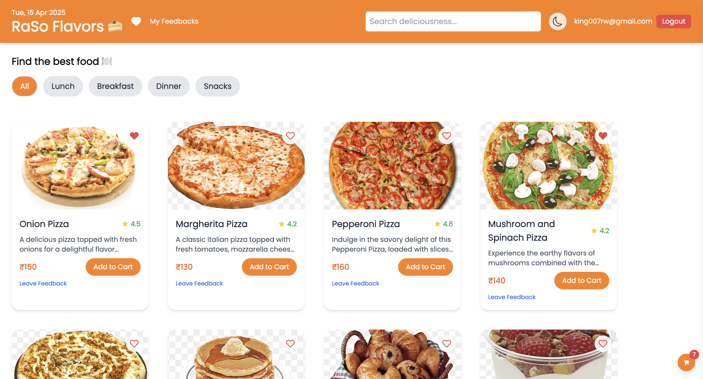
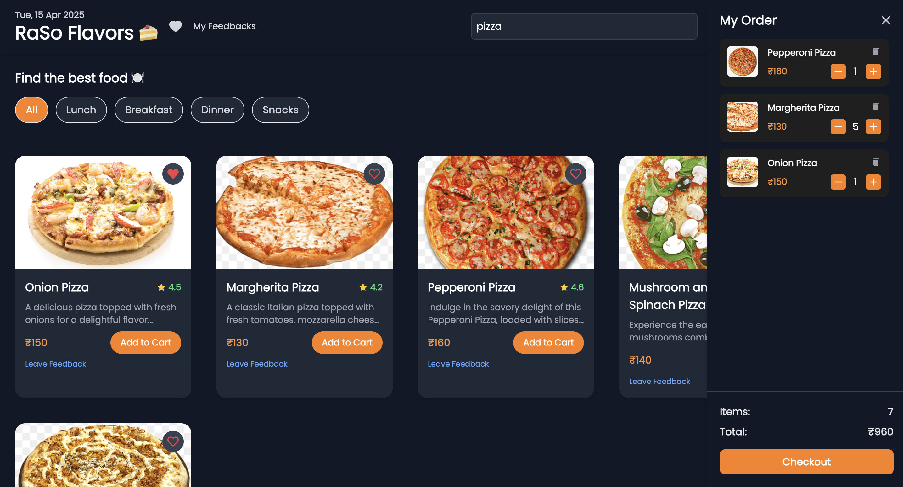
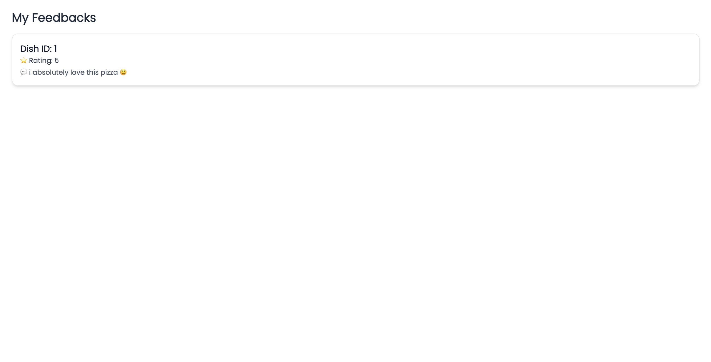
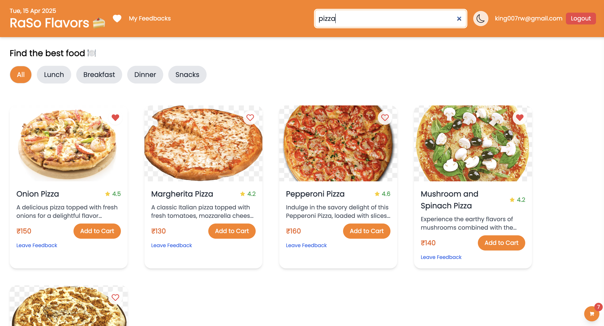
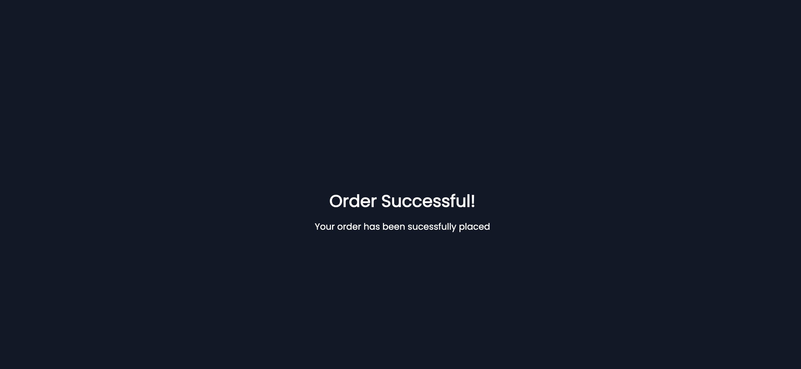

# React + Vite
# 🍽️ Raso Flavour

A React-based food delivery app with category filters, cart, favorites, and Firebase Auth. Deployed on Vercel.

## 🚀 Features
- 🔐 Firebase authentication (login/signup)
- 🛒 Persistent cart using local storage
- ❤️ Add-to-favorites with dedicated `/favorites` page
- 🔍 Search and filter by meal type
- 💬 Feedback/rating component
- 📱 Fully responsive design

## 🖼️ Screenshots

### 🏠 Home Page Black


### 🏠 Home Page White



### 🛒 Cart Page


### ❤️ Favorites Page


### Feedback Page



### Seachbar Page


### Order Completion


## ⚙️ Tech Stack
- ReactJS
- Firebase Auth
- LocalStorage
- TailwindCSS
- Vercel

## 📦 Installation

```bash
git clone https://github.com/sk-108/ra-so-flavour.git
cd ra-so-flavour
npm install
npm run dev
